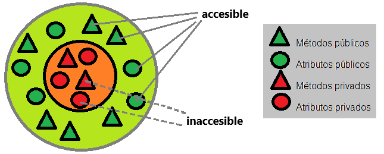

# TAREA DE INVESTIGACIÓN 
## ¿Qué son los paradigmas de programación?
#### Un paradigma de programación es una manera o estilo de programación de software. Existen diferentes formas de diseñar un lenguaje de programación y varios modos de trabajar para obtener los resultados que necesitan los programadores.  Se trata de un conjunto de métodos sistemáticos aplicables en todos los niveles del diseño de programas para resolver problemas computacionales.
Los lenguajes de programación adoptan uno o varios paradigmas en función del tipo de órdenes que permiten implementar como, por ejemplo, Python o JavaScript, que son multiparadigmas.

## **¿QUÉ ES LA PROGRAMACIÓN ORIENTADA A OBJETOS?**
#### La Programación Orientada a Objetos (POO) es un paradigma de programación, es decir, un modelo o un estilo de programación que nos da unas guías sobre cómo trabajar con él. Se basa en el concepto de clases y objetos. Este tipo de programación se utiliza para estructurar un programa de software en piezas simples y reutilizables de planos de código (clases) para crear instancias individuales de objetos. 

A lo largo de la historia, han ido apareciendo diferentes paradigmas de programación. Lenguajes secuenciales como COBOL o procedimentales como Basic o C, se centraban más en la lógica que en los datos. Otros más modernos como Java, C# y Python, utilizan paradigmas para definir los programas, siendo la Programación Orientada a Objetos la más popular. 

En los años 60, dos brillantes investigadores noruegos, Quisten Negar y Ole-Johan Del, desarrollaron la base de la programación orientada a objetos, creando el lenguaje Simula. Las nociones básicas de la POO como las clases, la herencia, los métodos virtuales, etc., fueron creados en este lenguaje para permitir modelizar de manera fidedigna procesos industriales complejos. Simula-67 había abierto la vía de los lenguajes orientados a objetos, como Smalltalk y más adelante C++, Java y C# entre otros, que explotarían estos conceptos algunas décadas más tarde.

Propuesto en 1980, Smalltalk es el primer lenguaje orientado a objetos disponible con un entorno de desarrollo gráfico integrado. Smalltalk fue diseñado por el equipo del americano Alan Kay, del centro de investigación informática californiana de XEROX (el famoso Palo Alto Research Center). Este lenguaje va a retomar y completar los conceptos básicos, fundamentalmente con la noción de compilación...

## ABSTRACCIÓN 
##### La abstracción en los lenguajes de programación orientada a objetas es la capacidad para que puedas reducir o eliminar un código complejo, es decir, eliminamos todo ese bad code innecesario para que nuestro programa tenga un mejor rendimiento y sea mas entendible para otros usuarios. 

Se considera una acción fundamental a la hora de realizar un código ya que ayuda al usuario a evitar escribir un código de bajo nivel, evitamo el duplicar algún proceso o código y se fomenta el reutilizar métodos, procesoos, etc. y ayuda a aumentar la seguridad en tu código ya que solo los detalles importantes son proporcionados al usuario.

## ENCAPSULAMIENTO 
Se refiere al ocultamiento de los datos miembros de un objeto, es decir, encapsular los atributos y métodos del objeto, de manera que sólo se pueda cambiar mediante las operaciones definidas para ese objeto.

Entonces la encapsulación es un mecanismo de protección o aislamiento de atributos y métodos, es decir, el aislamiento protege a los datos asociados de un objeto contra su modificación por quien no tenga derecho a acceder a ellos, eliminando efectos secundarios e interacciones en cuanto al ocultamiento de los datos miembros de un objeto.

## HERENCIA
La herencia en la programación orientada a objetos es un mecanismo mediante el cual una clase puede heredar propiedades y comportamientos de otra clase. En términos simples, una clase hija puede extender o especializar una clase padre.

En la herencia, la clase padre también se conoce como clase base o superclase, y la clase hija se conoce como clase derivada o subclase. La clase derivada hereda los atributos y métodos de la clase base, lo que significa que puede utilizarlos como si fueran propios.

# UML: DIAGRAMA DE CLASES 
El Lenguaje de Modelado Unificado (UML, por sus siglas en inglés) es un lenguaje de modelado visual utilizado para diseñar sistemas de software y otros sistemas complejos. Fue desarrollado por un grupo de expertos en lenguajes de modelado liderados por Grady Booch, James Rumbaugh e Ivar Jacobson en la década de 1990.

UML se utiliza en una amplia gama de sistemas, desde aplicaciones de software empresarial hasta sistemas de tiempo real y sistemas embebidos. Ha sido ampliamente utilizado en la industria del software y se ha convertido en un estándar en el modelado de sistemas.

En años recientes, UML ha seguido siendo ampliamente utilizado en la industria del software y ha evolucionado para adaptarse a las nuevas tecnologías y requisitos de los sistemas modernos. Uno de los diagramas más utilizados en UML es el diagrama de clases, que muestra la estructura estática de un sistema y las relaciones entre sus clases.

Existen diversas herramientas para el modelado en UML, tanto comerciales como de código abierto, que permiten a los desarrolladores y diseñadores crear y editar diagramas UML de manera visual y colaborativa. Algunas de estas herramientas incluyen Enterprise Architect, Visual Paradigm, Rational Rose, StarUML y ArgoUML, entre otras.

### ¿Sabes de alguna empresa local que utilice este lenguaje?
Existen varias empresas mexicanas que utilizan UML en sus procesos de diseño y desarrollo de software. Algunos ejemplos son:

* **_Grupo Modelo_**: Utiliza UML para modelar y diseñar sus sistemas de producción y distribución de cerveza.

* **_Telmex_**: Utiliza UML en el diseño y desarrollo de sus sistemas de telecomunicaciones y de gestión de redes.

* **_Pemex_**: Utiliza UML en el diseño y desarrollo de sus sistemas de control y monitoreo de sus procesos de producción y distribución de petróleo y gas.

* **_Softtek_**: Es una empresa de tecnología mexicana que utiliza UML en sus proyectos de desarrollo de software para clientes en diversos sectores, incluyendo banca, finanzas, telecomunicaciones, entre otros.

* **_Bimbo_**: Utiliza UML en el diseño y desarrollo de sus sistemas de producción y distribución de pan y otros productos de panadería

# Escribe una propuesta de una máquina que venda distintos artículos y haz el diagrama de clases del sistema que propones.
